<div align="center">

# Epic Infographics

### Infographics that don't look AI-made.

**An open-source skill that teaches AI agents to design infographics the way a studio would.**

No stock templates, no rounded card grids, no Tailwind blue, no emoji icons.
Every image below came straight out of the skill: brief in, PNG out, unedited.

[](https://github.com/OrRon/EpicInfographics/actions/workflows/ci.yml)
[](LICENSE)

</div>

<br>

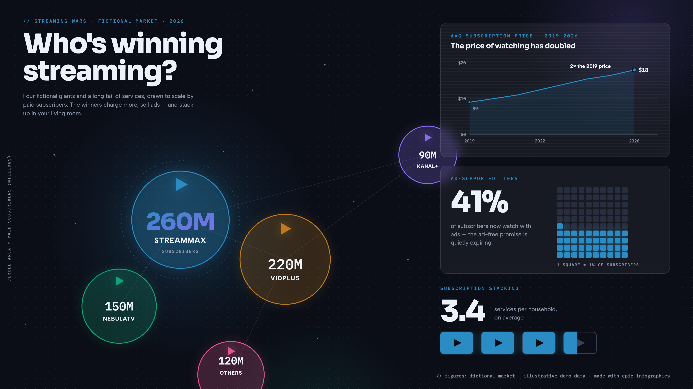

<table>
<tr>
<td width="50%">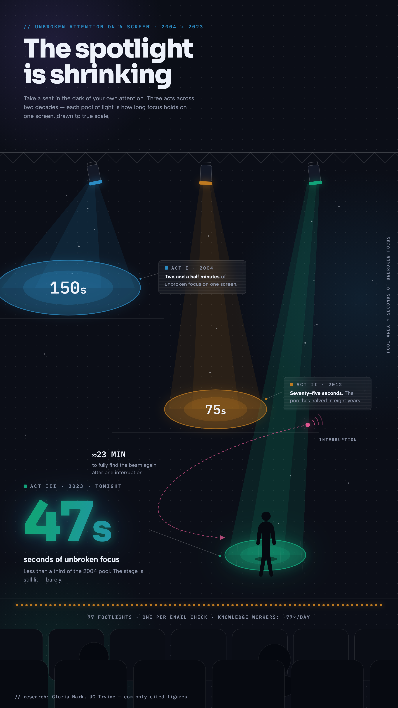</td>
<td width="50%">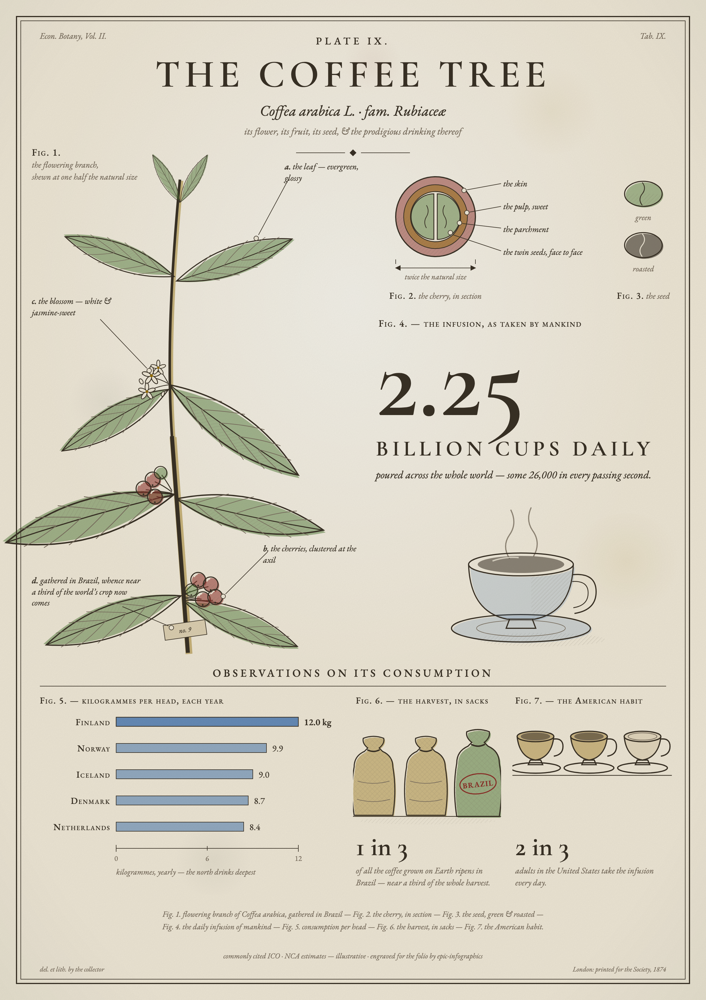</td>
</tr>
</table>

## Why this exists

Ask an AI for an infographic and you usually get the same thing: rounded
cards in a symmetric grid, Tailwind blue, an emoji where an icon should be,
and a bar chart floating on a flat background. It works, and it is instantly
recognizable as machine-made.

This skill writes down what a good studio actually does, as steps an agent
can follow without needing taste of its own:

- The canvas is a place, not a page. Every piece builds a scene (a drafting
  sheet, a dark theatre, a naturalist's folio, a miniature world) and the
  data lives inside that scene. Flat graphic minimalism counts as a failure
  here, even when it's tidy.
- The drawn object carries the data. A cup filled to two thirds because 2 in
  3 adults drink coffee. A rocket whose hatched section is exactly the 90%
  propellant fraction. A funnel of stage light drawn at 1px per 140 users.
- Charts are computed, never eyeballed. Bar ratios, donut arcs and areas
  come from arithmetic written into the file, and every palette goes through
  a color-blindness checker before it ships.
- The agent reviews its own render. Every graphic gets screenshotted, read
  back, and checked against a hard anti-slop list (the no-text squint test,
  the template test, the flat-ground test) before you ever see it.

## The gallery

Thirteen briefs, twelve design languages, six canvas formats, and every
piece animated. Click any image for its brief, its HTML source, and the
MP4 and GIF versions.

<table>
<tr>
<td align="center" width="33%"><a href="examples/rocket-launch/">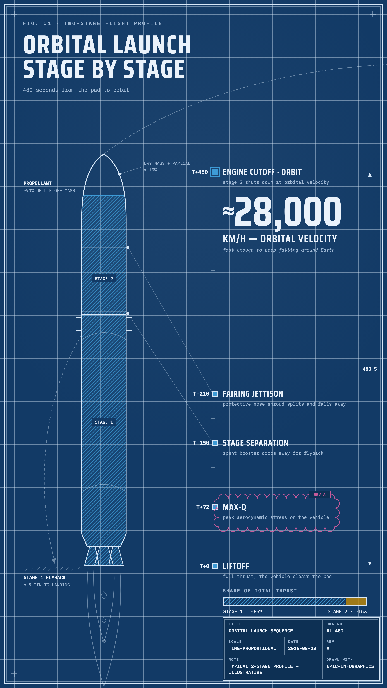</a><br><b>Orbital launch</b><br><sub>blueprint · story</sub></td>
<td align="center" width="33%"><a href="examples/tallest-buildings/">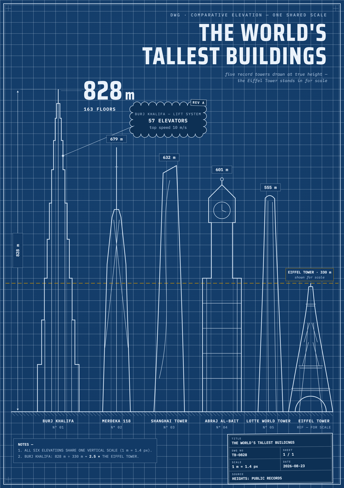</a><br><b>Tallest buildings</b><br><sub>blueprint · a4</sub></td>
<td align="center" width="33%"><a href="examples/launch-funnel/">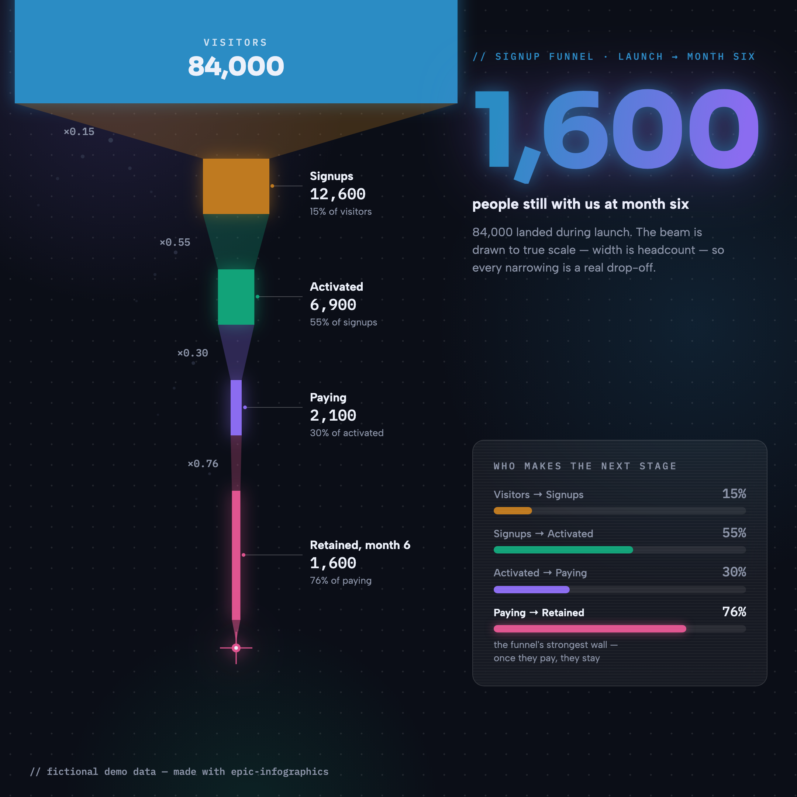</a><br><b>Signup funnel</b><br><sub>dark-glass · square</sub></td>
</tr>
<tr>
<td align="center" width="33%"><a href="examples/streaming-wars/"></a><br><b>The streaming wars</b><br><sub>dark-glass · wide</sub></td>
<td align="center" width="33%"><a href="examples/sleep/">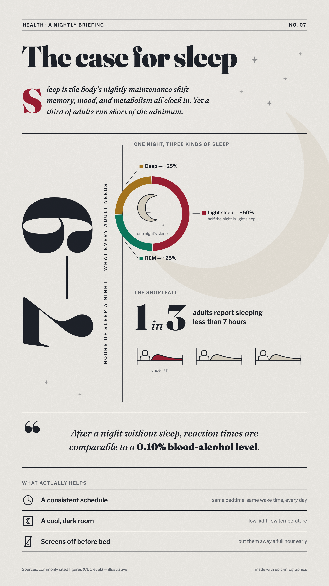</a><br><b>The case for sleep</b><br><sub>editorial · story</sub></td>
<td align="center" width="33%"><a href="examples/pizza-anatomy/">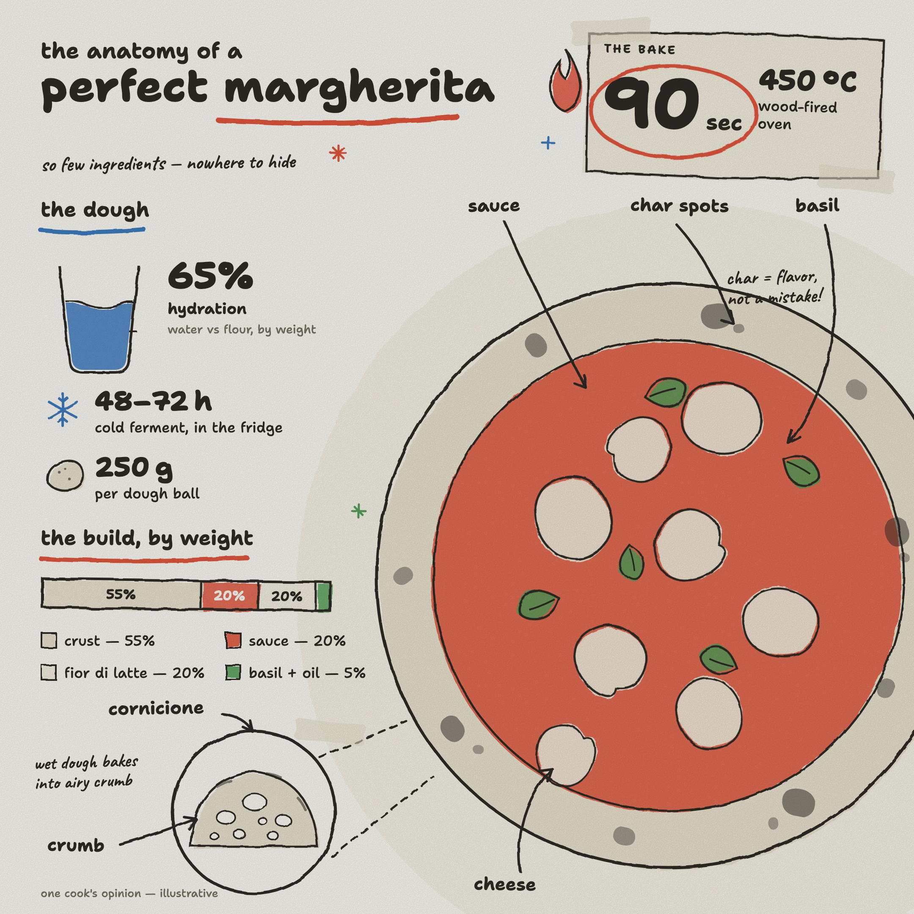</a><br><b>Anatomy of a margherita</b><br><sub>hand-drawn · square</sub></td>
</tr>
<tr>
<td align="center" width="33%"><a href="examples/honeybee-economy/">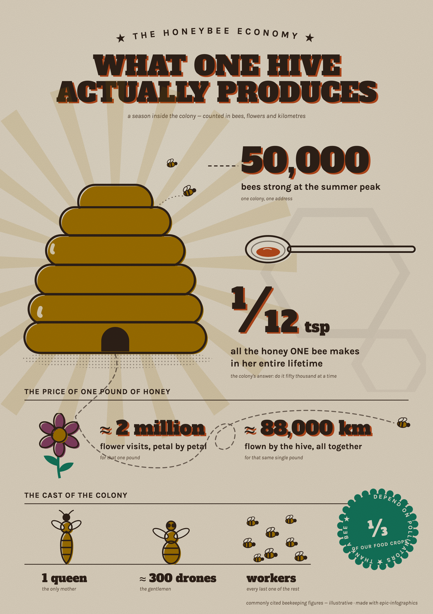</a><br><b>The honeybee economy</b><br><sub>retro-print · a4</sub></td>
<td align="center" width="33%"><a href="examples/coffee-botanical/"></a><br><b>The coffee tree</b><br><sub>naturalist-plate · a4</sub></td>
<td align="center" width="33%"><a href="examples/attention-spotlight/"></a><br><b>The spotlight is shrinking</b><br><sub>dark-glass · story</sub></td>
</tr>
<tr>
<td align="center" width="33%"><a href="examples/remote-vs-office-worlds/">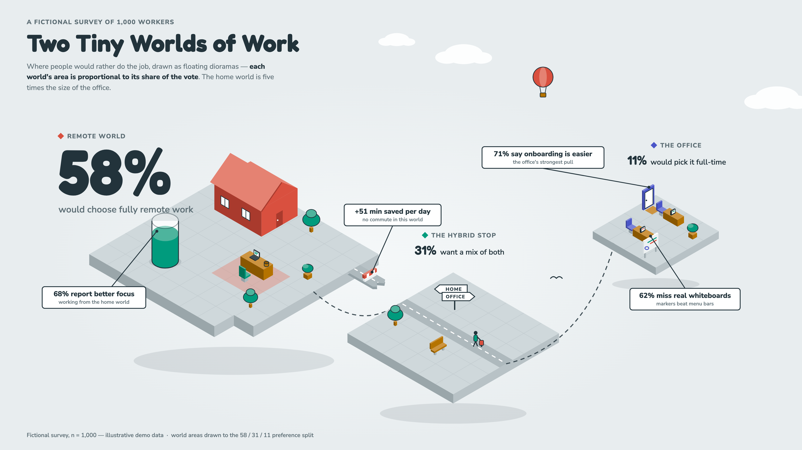</a><br><b>Two tiny worlds of work</b><br><sub>isometric-world · wide</sub></td>
<td align="center" width="33%"><a href="examples/web-history-road/">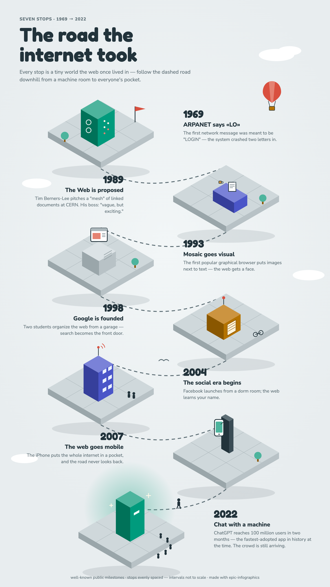</a><br><b>The road the internet took</b><br><sub>isometric-world · story</sub></td>
<td align="center" width="33%"><a href="examples/visit-mars/">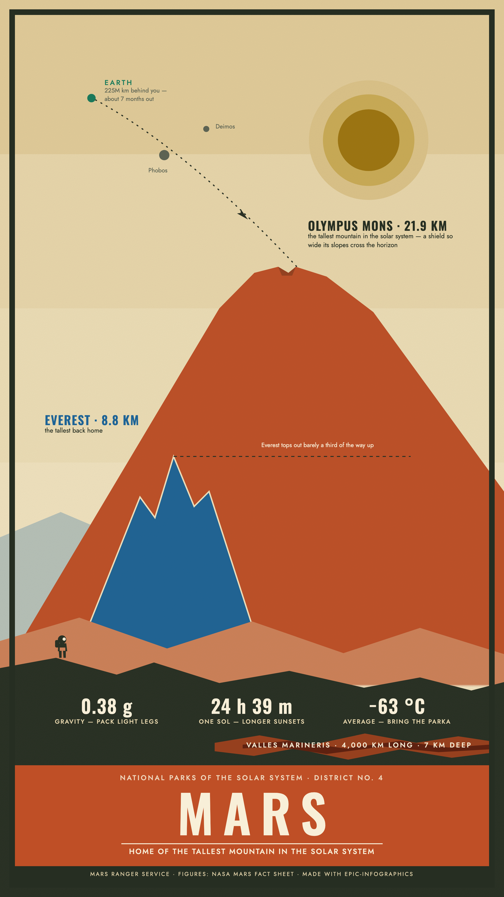</a><br><b>Visit Mars</b><br><sub>park-poster · story</sub></td>
</tr>
<tr>
<td align="center" width="33%"><a href="examples/wind-turbine/">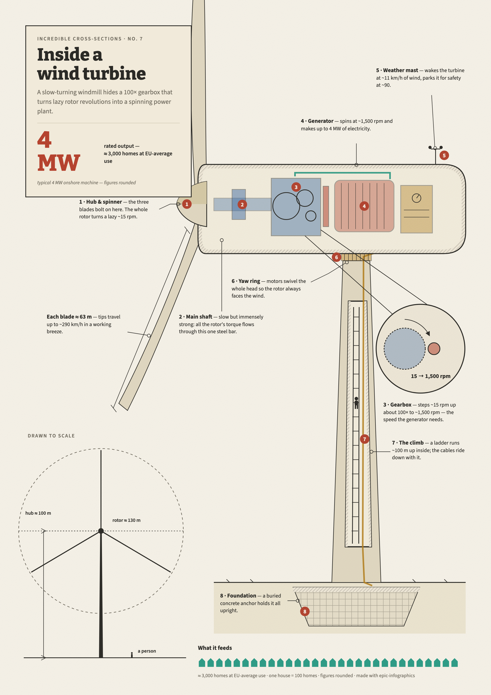</a><br><b>Inside a wind turbine</b><br><sub>cutaway · a4</sub></td>
<td align="center" width="33%"><br><b>Your brief here</b><br><sub>the skill made all of these;<br>test briefs in <a href="examples/briefs.md">examples/briefs.md</a></sub></td>
<td align="center" width="33%"></td>
</tr>
</table>

## It also moves

Every gallery piece is also a short animation, rendered from the same
HTML file as its still. The skill asks up front whether the graphic
should move, storyboards the build (the scene is already on stage, the
data arrives in order, the hero lands last), and choreographs it in the
design language's own motion character: the blueprint rocket is drafted
line by line, the honeybee poster arrives as screen-print ink passes,
the theatre runs its lighting cues, the Mars vista pulls layer by layer
off the screen. A bundled script scrubs the page's CSS animations frame
by frame in headless Chromium and assembles the MP4 and GIF with ffmpeg,
so every render is deterministic and the layout checks still hold on the
finished frame.


## The design languages

Each style file is a complete spec the agent can execute as written: exact
hexes, font pairings, geometry, signature devices, do's and don'ts. Every
chart palette passes a six-check color-blind-safety validation, including
the dark ones.

| Scene-native (the defaults) | |
|---|---|
| **blueprint** | cyanotype drafting sheet: dimension arrows, hatch fills, stamped title block |
| **dark-glass** | luminous data on deep space: aurora fields, glass panels, disciplined glow |
| **naturalist-plate** | 19th-century field-guide engraving: figure systems, watercolor tints, foxing |
| **isometric-world** | miniature floating dioramas: data as architecture, exact 2:1 projection |
| **retro-print** | mid-century poster: four inks, misregistration, film grain, arc text |
| **editorial** | magazine feature: Fraunces at huge sizes, drop caps, charticles |
| **hand-drawn** | marker sketchbook: wobble-filtered linework, washi tape, doodle arrows |
| **park-poster** | WPA screen-print vista: layered flat planes, title band, a tiny figure for scale |
| **cutaway** | DK-style cross-section: sliced machines, numbered callouts, detail lenses, tiny people |

| High slop-risk (explicit request only) | |
|---|---|
| **swiss** · **corporate-clean** · **neo-brutalist** | flat by construction; the skill only uses them when asked, and forces scene-craft into them |

## Install

**Claude Code**

```text
/plugin marketplace add OrRon/EpicInfographics
/plugin install epic-infographics@epic-infographics
```

Updates: `/plugin` → Marketplaces → epic-infographics → Enable auto-update.

**Codex**

```bash
codex plugin marketplace add OrRon/EpicInfographics
codex plugin add epic-infographics@epic-infographics
```

**Factory Droid**

```bash
droid plugin marketplace add https://github.com/OrRon/EpicInfographics
droid plugin install epic-infographics@epic-infographics --scope user
```

**Pi**

```bash
pi install https://github.com/OrRon/EpicInfographics
```

**Manual install (any agent that reads skill directories)**

```bash
git clone https://github.com/OrRon/EpicInfographics.git
# user-level:
cp -r EpicInfographics/skills/epic-infographics ~/.claude/skills/
# or project-level:
cp -r EpicInfographics/skills/epic-infographics your-project/.claude/skills/
```

One-time render setup, run inside the installed skill directory. If you
skip it, the agent runs it itself on the first render:

```bash
npm install && npx playwright install chromium
```

> The renderer needs a real browser engine because the graphics are
> HTML/CSS; that's what buys real text wrapping, web fonts, backdrop blur
> and blend modes. Playwright drives headless Chromium, waits for fonts
> before screenshotting, and renders at 2x for retina-crisp PNGs. This is
> render-side only, the HTML sources open in any browser.

## Quickstart

Then just talk to your agent:

```text
make me an infographic about our Q3 numbers, dark and dramatic, 16:9
```

```text
turn this data into a poster for the office printer  [paste a table]
```

```text
a fun square social graphic about how sourdough works, hand-drawn style
```

The agent first pins down who the graphic is for, what it needs to do,
and whether it should also move, gathers the data, then pitches you two
or three story angles as a multiple-choice question. Once you pick one, it selects a visual metaphor
that can carry real data, chooses a canvas and a design language, composes
the scene, builds it, renders it, and reviews its own PNG against the
checklist before handing it over. There are usually one or two self-correction loops you
never see.

## How it holds quality

- Rule zero: where is the reader standing? If the answer is "looking at a
  well-designed page", the agent starts over.
- Geometry is truthful. No eyeballed proportions, no dual axes, bars start
  at zero, area scales with value.
- No invented data. Figures are supplied or researched, and illustrative
  values are labeled as such in the footer of every example.
- Color is validated. Every palette, light and dark, passes lightness,
  chroma, contrast and colorblind-separation checks before it ships.
- Layout is verified by machine before any render. A preflight script loads
  the page headless, measures the real glyph geometry, and refuses to
  continue while text collides with other text, gets clipped, leaves the
  canvas, or falls below readable size.
- The render-review-fix loop is mandatory: at least one pass, with a
  checklist that treats "could be a dashboard template" as a hard fail.
- Motion is a layer on the approved still, never a substitute for one. The
  animation's final frame is the infographic itself, the same layout gates
  apply to it, and the agent reviews an eight-frame contact sheet of its
  own video before delivering.

## Architecture

```
skills/epic-infographics/
  SKILL.md                      entry point: workflow + hard rules (kept short)
  references/
    composition.md              rule zero + six named composition patterns
    illustration-and-texture.md metaphor-first method, grain/halftone/misregistration
    data-vocabulary.md          ~25 data forms, chosen by the question the data answers
    charts.md                   inline-SVG recipes with the math written out
    motion.md                   animation as staging: build order, easing, recipes
    design-languages/           one complete spec per style (+ _template.md)
  templates/skeleton.html       canvas boilerplate
  scripts/check.mjs             preflight gate: collisions, clipping, sizes, hero
  scripts/render.mjs            HTML -> PNG · 6 presets · font-safe · retina
  scripts/animate.mjs           HTML -> MP4/GIF · scrubbed CSS keyframes · ffmpeg
examples/                       brief + HTML + PNG for every gallery image
.claude-plugin/ .codex-plugin/  plugin + marketplace manifests
.factory-plugin/ .agents/         (Claude Code · Codex · Factory Droid · Pi)
scripts/validate.mjs            CI gate: manifests in sync, examples complete
.github/workflows/ci.yml        validator + headless render smoke test per PR
```

The skill is built around progressive disclosure: for any one graphic the
agent reads `SKILL.md`, one style file, and only the references the task
needs.

## Contributing

The most valuable thing you can add is a new design language. Copy
[`_template.md`](skills/epic-infographics/references/design-languages/_template.md),
fill in every section, validate your chart palette for color-blind safety
(don't eyeball it), and include one rendered example produced through the
skill. PRs that add a style without a rendered example won't be merged,
because the gallery is the test suite. The full checklist and the local
validation commands are in [CONTRIBUTING.md](CONTRIBUTING.md).

## License

MIT. Use it, fork it, ship it.
